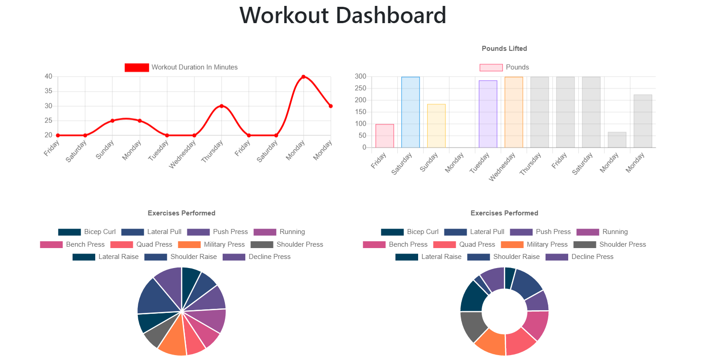

# Fitness Tracker

[](https://opensource.org/licenses/MIT)

## Description 

This application allows a user to accurately track their progress in the gym. It logs each workout and records how many reps, sets, duration, weight lifted, and distance covered per exercise. On the dashboard the user can see a graphical representation of their workouts. This app uses MongoDB as its database. 

Visit the website at: [Heroku](https://evening-tor-88716.herokuapp.com/)

## Preview


## Table of Contents

* [Techonologies Used](#technologies-used)
* [Usage](#usage)
* [Code Snippet](#code-snippet)
* [Questions](#questions)
* [Author Links](#author-links)

## Technologies Used

- JavaScript - programming language used for this app
- Node.js - runtime environment
- Express.js - back end web application framework
- MongoDB - non-relational database management system
- Mongoose - ODM
- Morgan - HTTP request logger middleware
- Insomnia - API client for testing REST endpoints
- Bootstrap - CSS Framework
- Git - version control
- Github - where the repository is hosted
- Heroku - where the project is deployed

## Usage

Click [here](https://evening-tor-88716.herokuapp.com/) to start effectively tracking your gains in the gym.

## Code Snippet

JavaScript code that sums up the totals for all exercises in a workout
```
function tallyExercises(exercises) {
  const tallied = exercises.reduce((acc, curr) => {
    if (curr.type === "resistance") {
      acc.totalWeight = (acc.totalWeight || 0) + curr.weight;
      acc.totalSets = (acc.totalSets || 0) + curr.sets;
      acc.totalReps = (acc.totalReps || 0) + curr.reps * curr.sets;
      acc.totalDuration = (acc.totalDuration || 0) + curr.duration;
    } else if (curr.type === "cardio") {
      acc.totalDistance = (acc.totalDistance || 0) + curr.distance;
      acc.totalDuration = (acc.totalDuration || 0) + curr.duration;
    }
    return acc;
  }, {});
  return tallied;
}
```

## License

This application is covered under the MIT license.

## Questions

Have any questions? My Github and email:

[My Github Link](https://github.com/mushymane)  
Email: mushymanee@gmail.com

## Author Links
[LinkedIn](https://www.linkedin.com/in/luigilantin/)